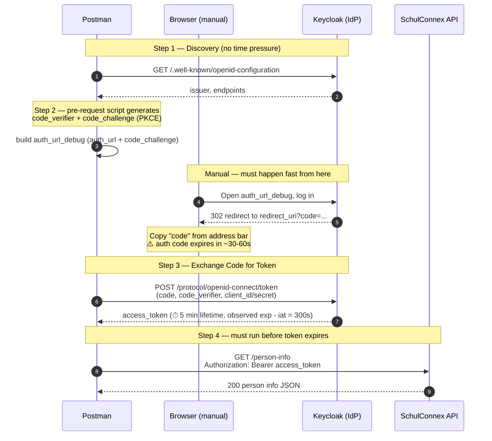

# Brandenburg SchulConnex Auth Flow

Manual PKCE-based Authorization Code flow used by the Postman collection
(`brandenburg-schulconnex.postman_collection.json`), for SVSINT-222.

## Components

- **Postman** — runs the requests, generates PKCE values, stores tokens in the environment.
- **Browser** (manual step) — where the actual login happens; Postman can't drive this part.
- **Keycloak** (`id-mbjs.brandenburg.de`, realm `schullogin`) — the identity provider (IdP). Issues the auth code and the access token.
- **SchulConnex API** (`id-mbjs.brandenburg.de/schulconnect/v1/person-info`) — the resource server we ultimately want data from.

## Flow + timing

## Time budget to reach "authenticated"

| Stage | Constraint |
|---|---|
| Step 1 → Step 2 | No real time limit — discovery + PKCE generation are cheap. |
| Step 2 → browser login → copy `code` | **Fast.** Keycloak authorization codes are short-lived (observed failures after ~30-60s delay: `invalid_grant` / "Token is not active"). Have the browser tab ready before generating the URL. |
| Copy `code` → Step 3 (token exchange) | **Fast**, same reason as above — don't pause to read/type slowly. |
| Step 3 → Step 4 (call `person-info`) | Access token is valid for **5 minutes** (300s, confirmed from decoded JWT `exp - iat`). Comfortable window, but don't leave the request sitting unsent. |

## Known gotcha

Request "4. Get Person Info" must have its **Authorization tab set to "No Auth"**,
not "Inherit auth from parent". The collection has an OAuth2 config at the
collection level (unrelated to this manual PKCE flow); if request 4 inherits it,
Postman's OAuth2 helper can silently overwrite the manual
`Authorization: Bearer {{access_token}}` header at send time, producing a
`401 Invalider Access-Token` even though the token itself is valid.
